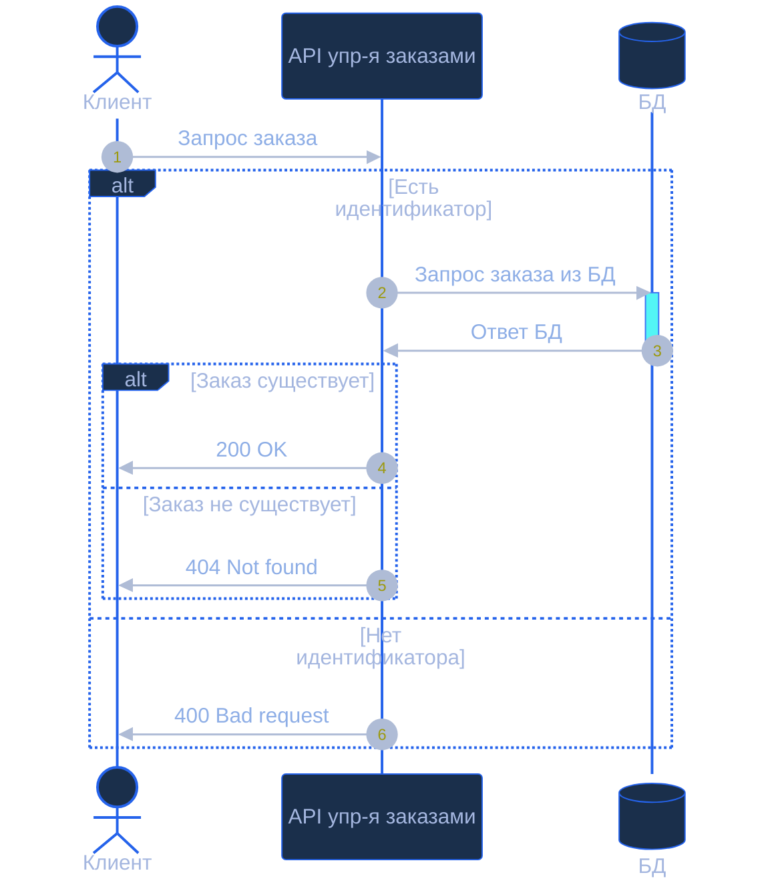
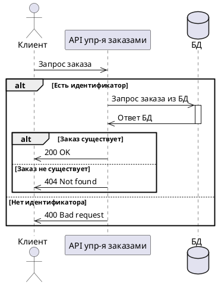
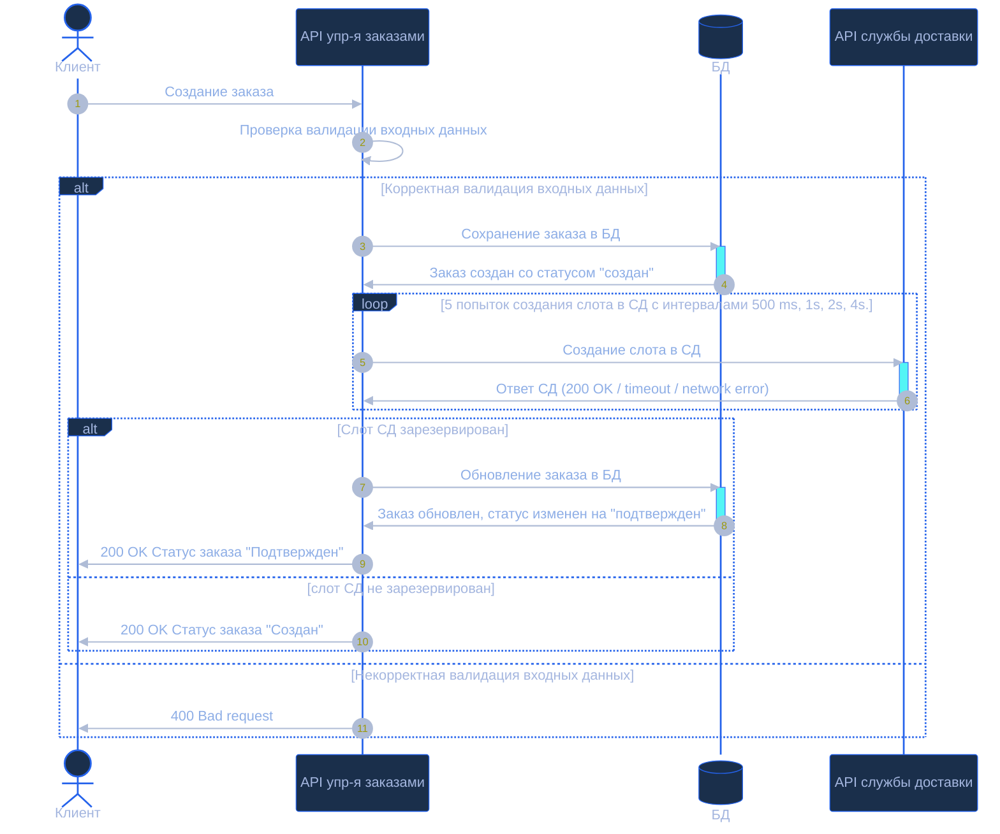
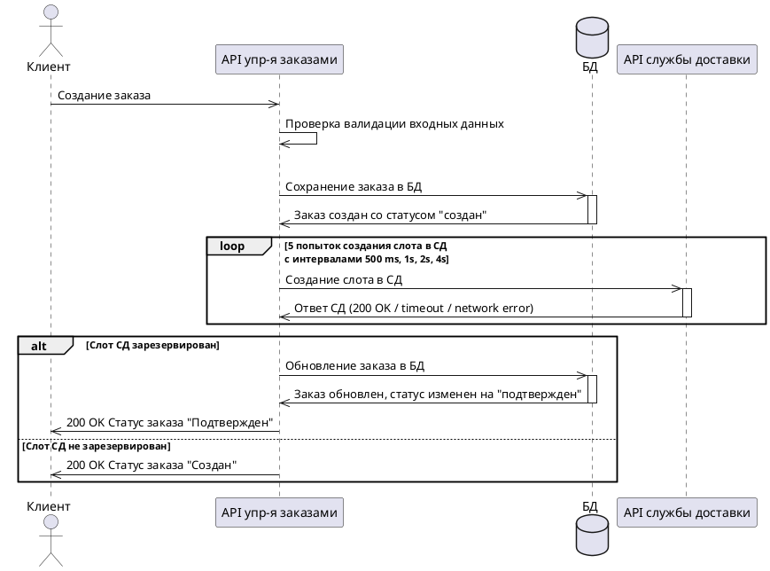

**1 Sequence-диаграммы**

**1.1 Sequence-диаграмма для метода GET /orders/{id}**

**1.2 Sequence-диаграмма для метода POST /orders**

**2 Таблицы контрактов API**

**2.1 Таблица контрактов API для метода GET /orders/{id}**

**2.1.1 Таблица входных параметров**

| Имя параметра | Тип данных | Обязательность | Описание             |
| ------------- | ---------- | -------------- | -------------------- |
| id            | number     | да             | Идентификатор заказа |

**2.1.2 Таблица выходных параметров при успешном запросе**

| Имя параметра | Тип данных  | Описание                                                          |
| ------------- | ----------- | ----------------------------------------------------------------- |
| id            | number      | Идентификатор заказа                                              |
| clientId      | number      | Идентификатор пользователя                                        |
| productId     | number      | Идентификатор товара                                              |
| city          | string      | Город, в который требуется доставка                               |
| firstname     | string      | Имя получателя                                                    |
| lastname      | string      | Фамилия получателя                                                |
| address       | string      | Адрес получателя                                                  |
| date          | string      | Дата доставки                                                     |
| time          | string      | Время доставки                                                    |
| status        | string      | Варианты: "создан", "подтвержден", "закончен", "отменен"          |
| deliveryId    | number/null | Идентификатор зарезервированного слота во внешней службе доставки |
| createdAt     | string      | Дата создания заказа                                              |
| updatedAt     | string      | Дата последнего изменения статуса заказа                          |

**2.1.3 Таблица выходных параметров при ответе с ошибкой**

| Имя параметра | Тип данных | Описание              |
| ------------- | ---------- | --------------------- |
| code          | string     | Код ошибки приложения |
| message       | string     | Текст ошибки          |

**2.2 Таблица контрактов API для метода POST /orders**

**2.2.1 Таблица входных параметров**

| Имя параметра | Тип данных | Обязательность | Описание                            |
| ------------- | ---------- | -------------- | ----------------------------------- |
| clientId      | number     | да             | Идентификатор пользователя          |
| productId     | number     | да             | Идентификатор товара                |
| city          | string     | да             | Город, в который требуется доставка |
| firstname     | string     | да             | Имя получателя                      |
| lastname      | string     | да             | Фамилия получателя                  |
| address       | string     | да             | Адрес получателя                    |
| date          | string     | нет            | Дата доставки                       |
| time          | string     | нет            | Время доставки                      |

**2.2.1.1 Таблица валидации входных параметров**

| Имя параметра | Что проверяется  | Правило валидации                                                       | Текст ошибки                                                               | HTTP-код |
| ------------- | ---------------- | ----------------------------------------------------------------------- | -------------------------------------------------------------------------- | -------- |
| clientId      | Наличие и тип    | Обязателен, должен быть числом больше 0                                 | Поле clientId обязательно и должно быть положительным числом               | 400      |
| productId     | Наличие и тип    | Обязателен, должен быть числом больше 0                                 | Поле productId обязательно и должно быть положительным числом              | 400      |
| city          | Наличие и формат | Обязателен, строка не должна быть пустой, число символов больше одного  | Поле city обязательно                                                      | 400      |
| firstname     | Наличие и формат | Обязателен, строка не должна быть пустой, число символов больше одного  | Поле firstname обязательно                                                 | 400      |
| lastname      | Наличие и формат | Обязателен, строка не должна быть пустой, число символов больше одного  | Поле lastname обязательно                                                  | 400      |
| address       | Наличие и формат | Обязателен, строка не должна быть пустой, число символов больше одного  | Поле address обязательно                                                   | 400      |
| date          | Формат даты      | Если передан, должен быть в формате YYYY-MM-DD и не раньше текущей даты | Поле date должно быть датой в формате YYYY-MM-DD и не может быть в прошлом | 400      |
| time          | Формат времени   | Если передан, должен быть в формате HH:mm                               | Поле time должно быть указано в формате HH:mm                              | 400      |

**2.2.2 Таблица выходных параметров при успешном запросе**

| Имя параметра | Тип данных  | Описание                                                          |
| ------------- | ----------- | ----------------------------------------------------------------- |
| id            | number      | Идентификатор заказа                                              |
| clientId      | number      | Идентификатор пользователя                                        |
| productId     | number      | Идентификатор товара                                              |
| city          | string      | Город, в который требуется доставка                               |
| firstname     | string      | Имя получателя                                                    |
| lastname      | string      | Фамилия получателя                                                |
| address       | string      | Адрес получателя                                                  |
| date          | string      | Дата доставки                                                     |
| time          | string      | Время доставки                                                    |
| status        | string      | Варианты: "создан", "подтвержден", "закончен", "отменен"          |
| deliveryId    | number/null | Идентификатор зарезервированного слота во внешней службе доставки |
| createdAt     | string      | Дата создания заказа                                              |
| updatedAt     | string      | Дата последнего изменения статуса заказа                          |

**2.2.3 Таблица выходных параметров при ответе с ошибкой**

| Имя параметра | Тип данных | Описание              |
| ------------- | ---------- | --------------------- |
| code          | string     | Код ошибки приложения |
| message       | string     | Текст ошибки          |

**3 Таблица маппинга**

| Поле нашей системы   | Поле внешнего API                              | Логика преобразования                                                 |
| -------------------- | ---------------------------------------------- | --------------------------------------------------------------------- |
| id                   | externalOrderId                                | Меняется название поля                                                |
| deliveryId           | id                                             | Меняется название поля                                                |
| city                 | destination.city                               | Город добавляется в объект "destination"                              |
| address              | destination.address                            | Адресс добавляется в объект "destination"                             |
| firstname + lastname | fullname                                       | Объединение двух полей в одно                                         |
| date                 | deliveryWindow.date                            | Дата добавляется в объект "deliveryWindow"                            |
| time                 | deliveryWindow.timeFrom, deliveryWindow.timeTo | Время добавляется в объект "deliveryWindow" и разбивается на два поля |
