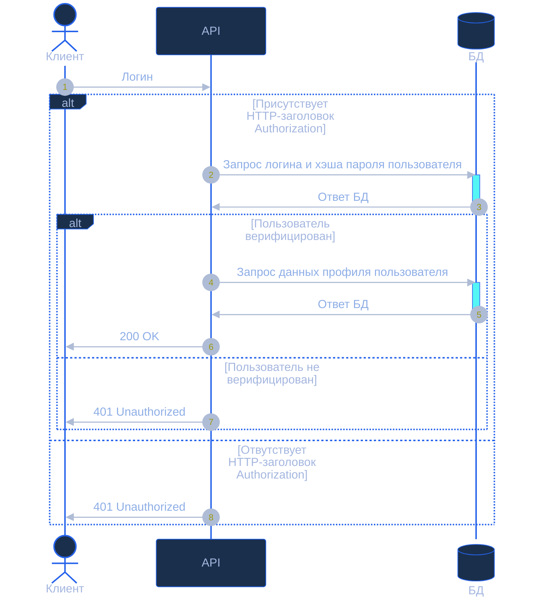

**1 Sequence-диаграмма**

**2 Таблицы контрактов API**

**2.1 Таблица входных параметров**

| Имя параметра | Тип данных | Обязательность | Описание                                                      |
| ------------- | ---------- | -------------- | ------------------------------------------------------------- |
| Authorization | string     | да             | Заголовок Basic Auth в формате Basic <base64(login:password)> |

**2.2 Таблица выходных параметров при успешном запросе**

| Имя параметра | Тип данных    | Описание                    |
| ------------- | ------------- | --------------------------- |
| id            | number        | Идентификатор сотрудника    |
| firstName     | string        | Имя сотрудника              |
| lastName      | string        | Фамилия сотрудника          |
| email         | string        | Корпоративная почта         |
| department    | string        | Подразделение               |
| position      | string        | Должность                   |
| phone         | string        | Телефон                     |
| roles         | array[string] | Роли пользователя в системе |
| createdAt     | string        | Дата создания профиля       |
| updatedAt     | string        | Дата последнего обновления  |

**2.1.3 Таблица выходных параметров при ответе с ошибкой**

| Имя параметра | Тип данных | Описание              |
| ------------- | ---------- | --------------------- |
| code          | string     | Код ошибки приложения |
| message       | string     | Текст ошибки          |

**3 Таблица маппинга**

| Поле нашей системы | Поле внешнего API | Логика преобразования                                                                  |
| ------------------ | ----------------- | -------------------------------------------------------------------------------------- |
| Authorization      | login, password   | Отделить схему Basic от токена, Декодировать из Base64, Разделить по первому двоеточию |
